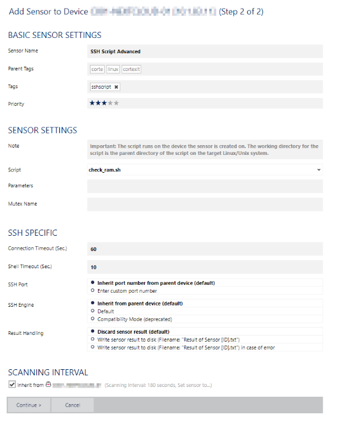

# Step by step Linux monitoring

## Setup structure and scripts on the server

### Create the structure on the server with this block command
To create the folder strucutre on the server, you just need to run this command block or run the script from the git (https://git.wird.cloud/cortex/monitoring/tree/master/Scripts%20PRTG):
```
if [ ! -d "/var/prtg" ]; then
mkdir /var/prtg /var/prtg/scripts /var/prtg/scriptsxml
touch /var/prtg/scripts/check_process.sh
chmod +x /var/prtg/scripts/check_process.sh
echo "" >> /var/prtg/scripts/check_process.sh
touch /var/prtg/scriptsxml/check_ram.sh
chmod +x /var/prtg/scriptsxml/check_ram.sh
echo "" >> /var/prtg/scriptsxml/check_ram.sh
fi
```

### Create the script to check the process
Like the last setp, you just need to run the following block command or copy the script from the git (https://git.wird.cloud/cortex/monitoring/tree/master/Scripts%20PRTG)
```
echo '
#!/bin/bash
data=`ps -ef | grep -v "grep" | grep -v "process.sh" | grep $1`
if [ -z "$data" ]
then
        msg="2:8:Process $1 down"
else
        msg="0:8:Process $1 up"
fi
echo $msg
' >> /var/prtg/scripts/check_process.sh
```


### Create the script to check the RAM
On this step, you'll need to copy the script into the server, as it's a little bit long. The easy way is to copy it from the git (https://git.wird.cloud/cortex/monitoring/tree/master/Scripts%20PRTG)


## Create device in PRTG
Where to create your device (MON-06,MON-07 or mon-08)?
### C001-MON-06
On the remote prob, you can add internal server and client server. That don't need any remote monitoring (from internet)

### C001-MON-07
On the remote prob, you can add internal datacenter server. On this node, you have a direct internal datacenter network (PDU,...)

### C001-MON-08
On the remote prob, you can add client and infra server that need to be monitored from internet. This node is  allowed to go on Internet and make a U-Turn to our infra.

### Create the device

Use the menu to create the new device </br>


Now select where to create the new device </br>


Set the device name, the ip address or DNS name. Define the client number (billing, CXXX), select the right icon. </br>


Do not activate the auto-discovery, it'll add too much and useless sensors. On this step, you can specific differents snmp community or ssh username and password, or use default account that is set on the root node


Same as the last screenshot, specify your account, ... or use the default one


Now your new device will be add to the monitoring, but in the legacy network, you'll need to create de device in the FW, and set the tag "MONITOR_CLIENT" "MONITOR_SSH". Add this device to a existing rules, or create a new one.

On the "new infra", actually (06.12.2019) I need to document this part. ask the OPS team for more info.

## Create sensors for the device

Now the new device is in the FW equipements. And added to a exisiting or new rules.

You can start to add some sensors, the is 3 level of monitoring

 - Basic (ping, disk, cpu, ram)
 - Advanced (process, services, ... )
 - Extra / specific monitoring (url string check, service app is running and usable, ...)


 For each new device, we'll start with the basic monitoring.

PING; CPU; DISK is very simple (snmp + network), for the RAM you need to add a SSH script Advanced sensors, and select the correct script in the dropdown list of this sensors.

 (The scripts need to be on the server, and you need to have access with ssh to list the script on the server)


